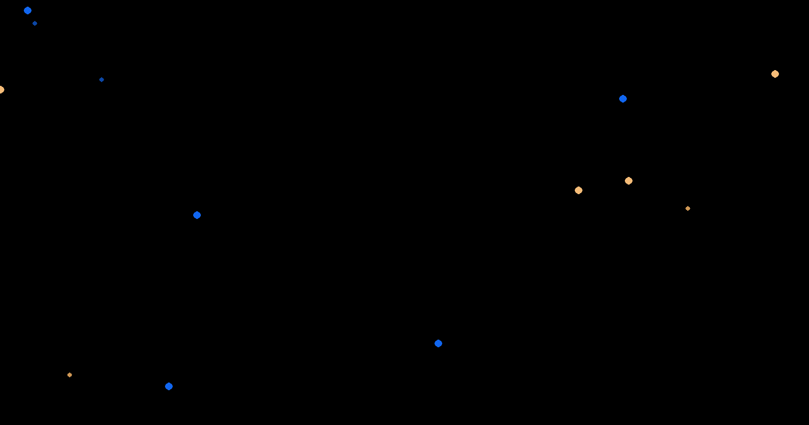
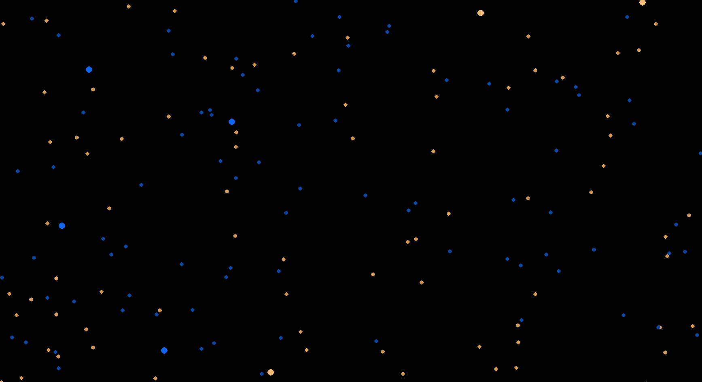
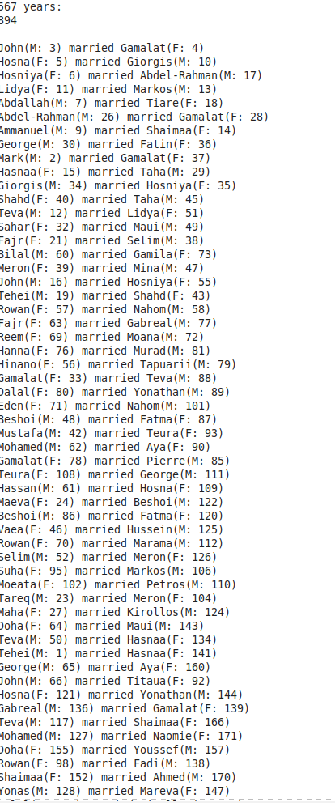
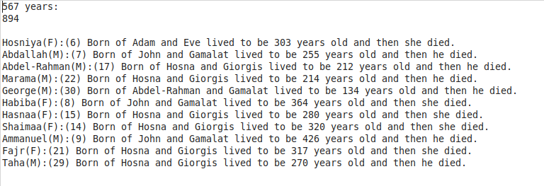
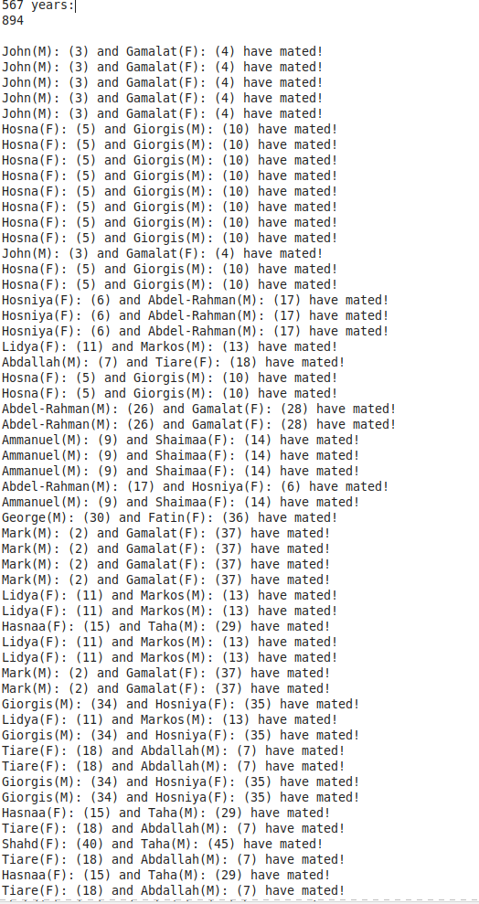
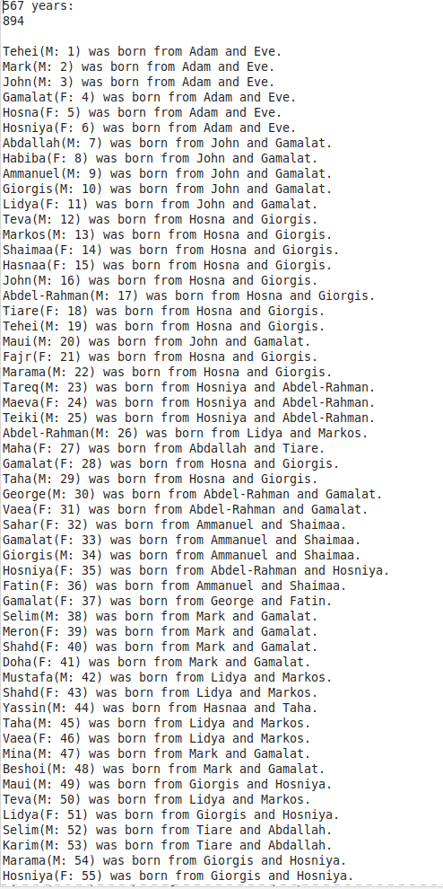

# Generations Simulator
___
 

### This is a python program that attempts to simulate populations. You can configure the length of years people can live and the age that they can begin to die. Currently, the program marries people if they come within a certain range from each other and if they do not currently have a spouse. Then this couple has a child and a home area is created for the parents. If the parents ever leave this area they are brought back into the area as long as they are both alive. This increases the likelihood that they will procreate once more.

 

## Other things I'm planning on adding:
* A visual system that will allow you to select any two people and see how they are related.  
  
 
  

## Other things you may consider adding:
* More than one child being born per birth
* Divorces, extramarital sex, early deaths of children
* family separations
* prevention of sibling marriage
* Use of numpy
* Instead of each dot representing a person, each dot could represent a group of people

 

## Files
I get the names of the simulated people from ./boynames and ./girlnames  
 
*.txt files are created after the program is run. Press (q) to quit the program or (r) to restart it. Pressing (q) writes all of the progress so far to the .txt files  
 
To run the program simply run Generations.py
 
## Screenshots
 
Early on, not many people alive. The large dots represent dead people, the smaller dots represent living people. Think of the large dots as gravestones.  

 

More people are now living

 

### Files generated by the program after pressing (q)
 

Marriages.txt  
  
 

Deaths.txt  
  
 

Mated.txt  
  
 

Births.txt  
  
 
